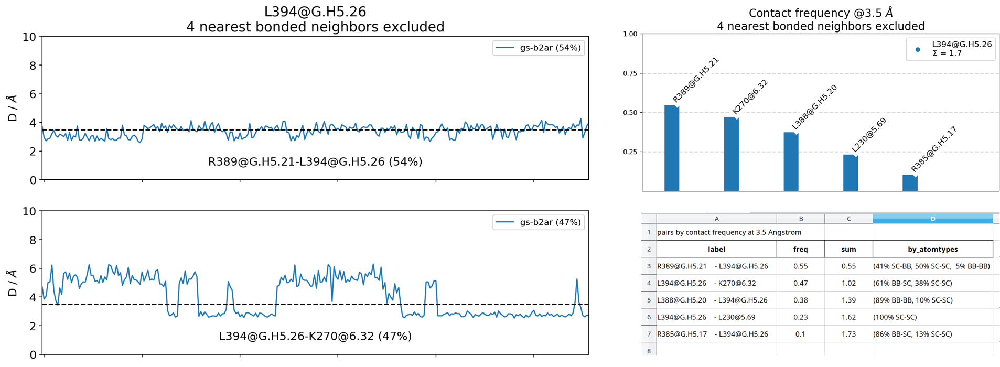
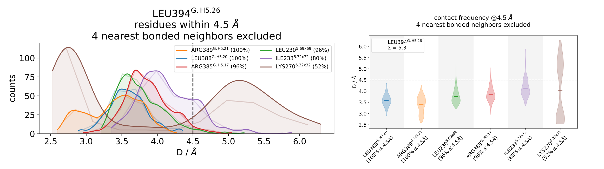
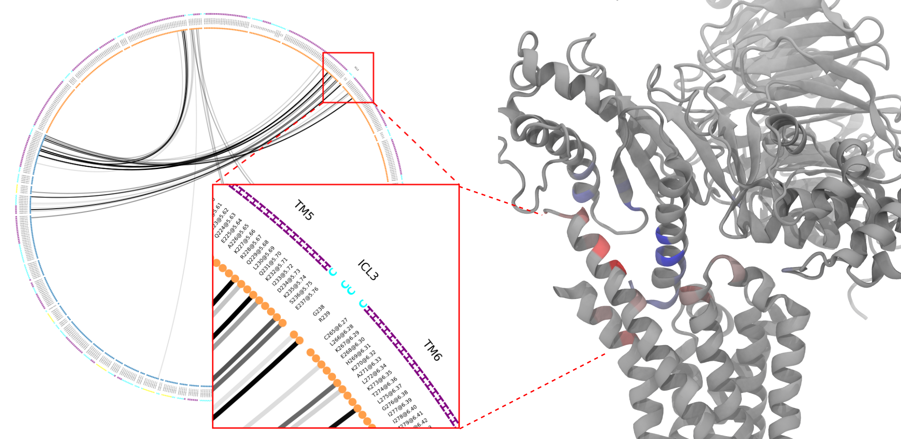

mdciao: Analysis of Molecular Dynamics Simulations Using Residue Neighborhoods
==============================================================================

|Pip Package| |Python Package| |MacOs Package| |Coverage| |DOI| |License|

``mdciao`` is a Python module that provides quick, "one-shot" command-line tools to analyze molecular simulation data using residue-residue distances. ``mdciao`` tries to automate as much as possible for non-experienced users while remaining highly customizable for advanced users, by exposing an API to construct your own analysis workflow.

Under the hood, the module `mdtraj <https://mdtraj.org/>`_ is doing most of the computation and handling of molecular information, using `BioPython <https://biopython.org/>`_ for sequence alignment, `pandas <pandas.pydata.org/>`_ for many table and IO related operations, and `matplotlib <https://matplotlib.org>`_ for visualizaton. It tries to automatically use the consensus nomenclature for

* GPCRs, e.g. `Ballesteros-Weinstein-Numbering <https://www.sciencedirect.com/science/article/pii/S1043947105800497>`_ or structure-based schemes by `Gloriam et al <https://doi.org/10.1016/j.tips.2014.11.001>`_,
* G-proteins, via `Common G-alpha Numbering (CGN) <https://www.mrc-lmb.cam.ac.uk/CGN/faq.html>`_, and
* Kinases, via their `85 pocket-residue numbering scheme <https://doi.org/10.1021/JM400378W>`_.

by either using local files or on-the-fly lookups of the `GPCRdb <https://gpcrdb.org/>`_
and/or `<https://www.mrc-lmb.cam.ac.uk/CGN/>`_ and/or `KLIFS <https://klifs.net/>`_, respectively.

Licenses
========
* ``mdciao`` is licensed under the `GNU Lesser General Public License v3.0 or later <https://www.gnu.org/licenses/lgpl-3.0-standalone.html>`_ (``LGPL-3.0-or-later``, see the LICENSE.txt).

* ``mdciao`` uses a modified version of the method `mdtraj.compute_contacts <https://github.com/mdtraj/mdtraj/blob/70a94ff87a6c4223ca1be78c752ef3ef452d3d44/mdtraj/geometry/contact.py#L42>`_  of `mdtraj <https://mdtraj.org/>`_. This modified version is published along with ``mdciao`` and can be found in `contacts/_md_compute_contacts.py <mdciao/contacts/_md_compute_contacts.py>`_. Please see that file for details on the modifications.

* Modules used by ``mdciao`` have different licenses. You can check any module's license in your Python environment using `pip-licenses <https://github.com/raimon49/pip-licenses>`_:

  >>> pip-licenses | grep module_name

Status
======
``mdciao`` is in its initial development, with versions 0.Y.Z. Anything MAY change at any time.
`The public API SHOULD NOT be considered stable <https://semver.org/#spec-item-4>`_.

Documentation
=============
Currently, docs are hosted at `<http://proteinformatics.org/mdciao/>`_, but this can change in the future.

TODOs
=====
This is an informal list of known issues and TODOs:
 * keeping vs reporting contacts: a design choice has to be made wrt to the effect of ctc_cutoff_Ang on a ContactGroup:
   If a given cutoff makes a ContactPair have freq=0, should the CP be kept in the CG, simply not reported? There's now a branch for that: https://github.com/gph82/mdciao/tree/buffer_neighborhood
 * overhaul the "printing" system with proper logging and warnings (perhaps use `loguru <https://github.com/Delgan/loguru>`_)
 * progressbar not very informative for one chunked trajectory or parallel runs
 * Building the docs with sphinx v>2.4.4 doesn't autogen a class' method's linked doc
 * the affiliation of a residue to a fragment is done as "res@frag" on the string output and res^frag in figures, this implementation is simply using replace("@","^"), could be better
 * parallel execution with memory mdtraj.Trajectory objects should be better
 * harmonize documentation API cli methods (mdciao.cli) and the CLI scripts (mdc_*)
 * The interface between API methods and cli scripts could be better, using sth like `click <https://click.palletsprojects.com/en/7.x/>`_
 * The API-cli methods (interface, neighborhoods, sites, etc) have very similar flows but a lot of code repetition, I am sure `some patterns/boilerplate could be outsourced/refactored even more <https://en.wikipedia.org/wiki/Technical_debt>`_.
 * Most of the tests were written against a very rigid API that mimicked the CLI closely. Now the API is more flexible
   and many `tests could be re-written or deleted <https://en.wikipedia.org/wiki/Technical_debt>`_ , like those needing
   mock-input or writing to tempdirs because writing figures or files could not be avoided.
 * There's some inconsistencies in private vs public attributes of classes. An attribute might've "started" as private and is exceptionally used somewhere else until the number of exceptions is enough for it to make sense to be public, documented and well tested. I'm working on it.
 * neighborlists could be computed much more efficiently
 * The labelling names should be harmonized (ctc_label, anchor_res...) and the logic of how/where it get's constructed (short_AA vs AA_format) is not obvious sometimes
 * There's many other TODOs spread throughout the code
 * The way uniprot or PDB codes are transformed to relative and/or absolute filenames to check if they exist locally should be unified across all lookup functions, like GPCR_finder, PDB_finder and/or the different LabelerConsensus objects, possibly by dropping optargs like 'local_path' or 'format'.
 * Some closely related methods could/should be integrated into each other by generalising a bit, but sometimes the generalisation is unnecessarily complicated to code (or I simply forget that the closely related method already exists) and re-code (and test!) for a slightly different scenario (though I try to hard to avoid it). E.g. there's several methods for computing, reporting, and saving contact frequencies and contact-matrices, or different methods to assign residue idxs to fragments, depending on particual the goal of the assignment, like find_parent_list, in_what_(N)_fragments, or assign_fragments. Still, I opted for more smaller methods, which are individually easier to maintain, but that could simply be a `questionable choice <https://en.wikipedia.org/wiki/Technical_debt>`_.
 * The 'dictionary unifying' methods could be preplaced with pandas.DataFrame.merge/join

System Requirements
===================
``mdciao`` is developed in GNU/Linux, and CI-tested via `github actions <https://github.com/gph82/mdciao/actions?query=workflow%3A%22Python+package%22>`_ for GNU/Linux and MacOs. Tested python versions are:

* GNU/Linux: 3.7, 3.8, 3.9, 3.10
* MacOs: 3.7, 3.8, 3.9

So everything should work *out of the box* in these conditions.

Authors
=======
``mdciao`` is written and maintained by Guillermo Pérez-Hernández (`ORCID <http://orcid.org/0000-0002-9287-8704>`_) currently at the `Institute of Medical Physics and Biophysics <https://biophysik.charite.de/ueber_das_institut/team/>`_ in the
`Charité Universitäsmedizin Berlin <https://www.charite.de/>`_.

Please cite "mdciao, G. Pérez-Hernández and P.W. Hildebrand, 2022 (submitted)"

.. |Pip Package| image::
   https://badge.fury.io/py/mdciao.svg
   :target: https://badge.fury.io/py/mdciao

.. |Python Package| image::
   https://github.com/gph82/mdciao/actions/workflows/python-package.yml/badge.svg
   :target: https://github.com/gph82/mdciao/actions/workflows/python-package.yml

.. |MacOs Package| image::
   https://github.com/gph82/mdciao/actions/workflows/python-package.macos.yml/badge.svg
   :target: https://github.com/gph82/mdciao/actions/workflows/python-package.macos.yml

.. |Coverage| image::
   https://codecov.io/gh/gph82/mdciao/branch/master/graph/badge.svg?
   :target: https://codecov.io/gh/gph82/mdciao

.. |License| image::
    https://img.shields.io/github/license/gph82/mdciao

.. |DOI| image::
   https://zenodo.org/badge/DOI/10.5281/zenodo.5643177.svg
   :target: https://doi.org/10.5281/zenodo.5643177

