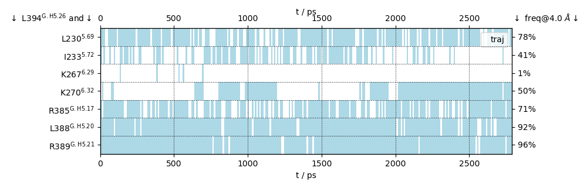

mdciao: Accessible Analysis and Visualization of Molecular Dynamics Simulation Data
===================================================================================

|Pip Package| |Python Package| |MacOs Package| |Coverage| |DOI| |License|

..
   figure:: doc/imgs/banner.png
   :scale: 33%
..
   figure:: doc/imgs/distro_and_violin.png
   :scale: 25%

..
   figure:: doc/imgs/interface.combined.png
   :scale: 33%

``mdciao`` is a Python module that provides quick, "one-shot" command-line tools to analyze molecular simulation data using residue-residue distances. ``mdciao`` tries to automate as much as possible for non-experienced users while remaining highly customizable for advanced users, by exposing an API to construct your own analysis workflow.

Under the hood, the module `mdtraj <https://mdtraj.org/>`_ is doing most of the computation and handling of molecular information, using `BioPython <https://biopython.org/>`_ for sequence alignment, `pandas <pandas.pydata.org/>`_ for many table and IO related operations, and `matplotlib <https://matplotlib.org>`_ for visualizaton. It tries to automatically use the consensus nomenclature for

* GPCRs, e.g. `Ballesteros-Weinstein-Numbering <https://www.sciencedirect.com/science/article/pii/S1043947105800497>`_ or structure-based schemes by `Gloriam et al <https://doi.org/10.1016/j.tips.2014.11.001>`_,
* G-proteins, via `Common G-alpha Numbering (CGN) <https://www.mrc-lmb.cam.ac.uk/CGN/faq.html>`_, and
* Kinases, via their `85 pocket-residue numbering scheme <https://doi.org/10.1021/JM400378W>`_.

by either using local files or on-the-fly lookups of the `GPCRdb <https://gpcrdb.org/>`_
and/or `KLIFS <https://klifs.net/>`_.

Licenses
========
* ``mdciao`` is licensed under the `GNU Lesser General Public License v3.0 or later <https://www.gnu.org/licenses/lgpl-3.0-standalone.html>`_ (``LGPL-3.0-or-later``, see the LICENSE.txt).

* ``mdciao`` uses a modified version of the method `mdtraj.compute_contacts <https://github.com/mdtraj/mdtraj/blob/70a94ff87a6c4223ca1be78c752ef3ef452d3d44/mdtraj/geometry/contact.py#L42>`_  of `mdtraj <https://mdtraj.org/>`_. This modified version is published along with ``mdciao`` and can be found in `contacts/_md_compute_contacts.py <mdciao/contacts/_md_compute_contacts.py>`_. Please see that file for details on the modifications.

* Modules used by ``mdciao`` have different licenses. You can check any module's license in your Python environment using `pip-licenses <https://github.com/raimon49/pip-licenses>`_:

  >>> pip-licenses | grep module_name

Documentation
=============
Currently, docs are hosted at `<http://proteinformatics.org/mdciao/>`_, but this can change in the future.

System Requirements
===================
``mdciao`` is developed in GNU/Linux, and CI-tested via `github actions <https://github.com/gph82/mdciao/actions>`_ for GNU/Linux and MacOs. Tested Python versions are:

* GNU/Linux: 3.7, 3.8, 3.9, 3.10, 3.11
* MacOs: 3.7, 3.8, 3.9, 3.10, 3.11. For Python 3.7, four CI-tests involving `mdtraj.compute_dssp <https://www.mdtraj.org/1.9.8.dev0/api/generated/mdtraj.compute_dssp.html?highlight=dssp#mdtraj.compute_dssp>`_ , are skipped because of a hard to repdroduce, random segmentation fault, which apparently wont fix, see here `<https://github.com/mdtraj/mdtraj/issues/1574>`_ and  `here <https://github.com/mdtraj/mdtraj/issues/1473>`_.

So everything should work *out of the box* in these conditions.

.. admonition:: Python 3.12 users

   If you try to install on Python 3.12, you will get a dependency error, because

   * the module ``bezier`` `requires Numpy >= 2.0 for Python 3.12 <https://github.com/dhermes/bezier/releases/tag/2024.6.20>`_, but
   * the module ``mdtraj`` `has pinned Numpy <= 2.0 <https://github.com/mdtraj/mdtraj/issues/1873/>`_.

   Still, you can install mdciao in Python 3.12 **if you don't mind a somewhat inconsistent environment**:

   >>> pip install bezier
   >>> pip install mdtraj --use-deprecated=legacy-resolver
   >>> pip install mdciao --use-deprecated=legacy-resolver

   What we are doing is installing ``bezier`` normally (using ``numpy>=2.0``) and then installing ``mdtraj`` using ``pip``'s legacy resolver, which will install ``numpy-1.26.4`` even if that yields an inconsistent environment. You will get the notification:

   >>> ERROR: pip's legacy dependency resolver does not consider dependency conflicts when selecting packages. This behaviour is the source of the following dependency conflicts.
   >>> mdtraj 1.10.0 requires numpy<2.0.0a0,>=1.23, but you'll have numpy 2.0.0 which is incompatible.

   Since ``mdciao`` installs and passes the CI-tests for Python 3.12 in such an environment, you can use it **at your own risk**. Please report on any issues you might find. Please note that the ``--use-deprecated=legacy-resolver`` option `might not be available in the future <https://pip.pypa.io/en/stable/user_guide/#deprecation-timeline>`_.

Authors
=======
``mdciao`` is written and maintained by Guillermo Pérez-Hernández (`ORCID <http://orcid.org/0000-0002-9287-8704>`_) currently at the `Institute of Medical Physics and Biophysics <https://biophysik.charite.de/ueber_das_institut/team/>`_ in the
`Charité Universitäsmedizin Berlin <https://www.charite.de/>`_.

Please cite:
 * mdciao: Accessible Analysis and Visualization of Molecular Dynamics Simulation Data
    | Guillermo Pérez-Hernández, Peter-Werner Hildebrand
    | bioRxiv 2022.07.15.500163
    | https://doi.org/10.1101/2022.07.15.500163

Status
======
``mdciao`` is approaching its first major release, so less changes in the API and CLI calls are expected. For more info on semantic versioning please check
`the semver page <https://semver.org/#spec-item-4>`_.

Scope
======
``mdciao`` originated as a loose collection of CLI scripts used in our lab to streamline contact-frequency analysis of MD simulations with `mdtraj <https://mdtraj.org/>`_,
which is doing a lot of the heavy work under the hood of ``mdciao``. The goal was to take the less scripting-affine
lab members from their raw data to informative graphs about the general vicinity of *their* residues
of interest without much hassle. From there, it grew to incorporate many of the things routinely done in the lab
(with a focus on GPCRs and G proteins) and ultimately a package available for third-party use was made.

The main publications which have driven the development of ``mdciao`` are:
 * Function and dynamics of the intrinsically disordered carboxyl terminus of β2 adrenergic receptor.
    | Heng, J., Hu, Y., Pérez-Hernández, G. et al.
    | Nat Commun 14, 2005 (2023).
    | https://doi.org/10.1038/s41467-023-37233-1
 * Time-resolved cryo-EM of G-protein activation by a GPCR.
    | Papasergi-Scott, M.M., Pérez-Hernández, G., Batebi, H. et al.
    | Nature 629, 1182–1191 (2024).
    | https://doi.org/10.1038/s41586-024-07153-1
 * Mechanistic insights into G-protein coupling with an agonist-bound G-protein-coupled receptor.
    | Batebi, H., Pérez-Hernández, G., Rahman, S.N. et al.
    | Nat Struct Mol Biol (2024).
    | https://doi.org/10.1038/s41594-024-01334-2

TODOs
=====
This is an informal list of known issues and TODOs:
 * adopt this project structure https://github.com/MolSSI/cookiecutter-cms
 * keeping vs reporting contacts: a design choice has to be made wrt to the effect of ctc_cutoff_Ang on a ContactGroup:
   If a given cutoff makes a ContactPair have freq=0, should the CP be kept in the ConctactGroup, simply not reported? The `max_cutoff_Ang` is already in place s.t. you can have a buffer of some Angstrom, but then the ContactGroup.n_ctcs would be hard to interpret.
 * overhaul the "printing" system with proper logging and warnings (perhaps use `loguru <https://github.com/Delgan/loguru>`_)
 * the affiliation of a residue to a fragment is done as "res@frag" on the string output and res^frag in figures, this implementation is simply using replace("@","^"), could be better
 * harmonize documentation API cli methods (mdciao.cli) and the CLI scripts (mdc_*)
 * The interface between API methods and cli scripts could be better, using sth like `click <https://click.palletsprojects.com/en/7.x/>`_
 * The API-cli methods (interface, neighborhoods, sites, etc) have very similar flows, and although a lot of effort has been put into refactoring into smaller methods, there's still some repetition.
 * Most of the tests were written against a very rigid API that mimicked the CLI closely. Now the API is more flexible
   and many `tests could be re-written or deleted <https://en.wikipedia.org/wiki/Technical_debt>`_ , like those needing
   mock-input or writing to tempdirs because writing figures or files could not be avoided.
 * There's some inconsistencies in private vs public attributes of classes. An attribute might've "started" as private and is exceptionally used somewhere else until the number of exceptions is enough for it to make sense to be public, documented and well tested. I'm working on it.
 * neighborlists could be computed much more efficiently
 * The labelling names should be harmonized (ctc_label, anchor_res...) and the logic of how/where it get's constructed (short_AA vs AA_format) is not obvious sometimes
 * The way uniprot or PDB codes are transformed to relative and/or absolute filenames to check if they exist locally should be unified across all lookup functions, like GPCR_finder, PDB_finder and/or the different LabelerConsensus objects, possibly by dropping optargs like 'local_path' or 'format'.
 * Some closely related methods could/should be integrated into each other by generalising a bit, but sometimes the generalisation is unnecessarily complicated to code (and test!) for a slightly different scenario (though I try to hard to avoid it). E.g. there's several methods for computing, reporting, and saving contact frequencies and contact-matrices, or different methods to assign residue idxs to fragments, `find_parent_list, `in_what_N_fragments`, or `assign_fragments. Still, I opted for more smaller methods, which are individually easier to maintain, but that could simply be a `questionable choice <https://en.wikipedia.org/wiki/Technical_debt>`_.
 * The 'dictionary unifying' methods could be replaced with pandas.DataFrame.merge/join
 * Writing to files, file manipulation should be done with pathlib
 * There's many other TODOs spread throughout the code

.. |Pip Package| image::
   https://badge.fury.io/py/mdciao.svg
   :target: https://badge.fury.io/py/mdciao

.. |Python Package| image::
   https://github.com/gph82/mdciao/actions/workflows/python-package.yml/badge.svg
   :target: https://github.com/gph82/mdciao/actions/workflows/python-package.yml

.. |MacOs Package| image::
   https://github.com/gph82/mdciao/actions/workflows/python-package.macos.yml/badge.svg
   :target: https://github.com/gph82/mdciao/actions/workflows/python-package.macos.yml

.. |Coverage| image::
   https://codecov.io/gh/gph82/mdciao/branch/master/graph/badge.svg?
   :target: https://codecov.io/gh/gph82/mdciao

.. |License| image::
    https://img.shields.io/github/license/gph82/mdciao

.. |DOI| image::
   https://zenodo.org/badge/DOI/10.5281/zenodo.5643177.svg
   :target: https://doi.org/10.5281/zenodo.5643177

