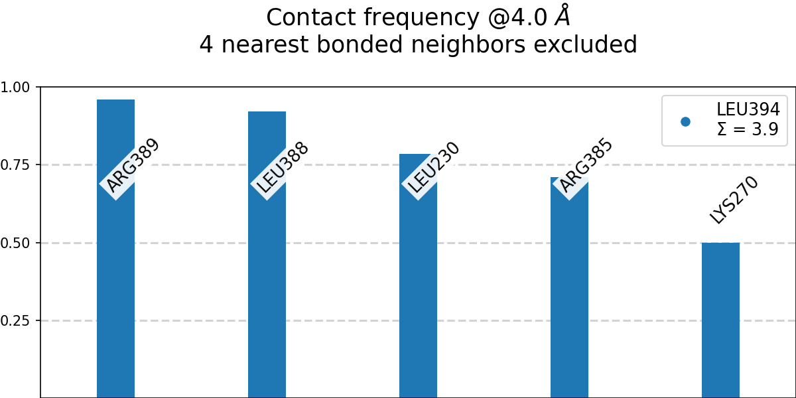
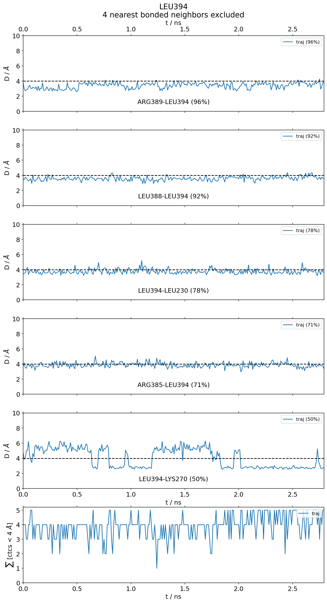

.. _`Basic-Usage`:

Basic Usage
-----------

.. _`3D visualization`:

Below you will find a very simple example of how to use ``mdciao`` from the command-line. Keep scrolling to the :ref:`Highlights` for more elaborate CLI-examples or jump to the :ref:`Jupyter Notebook <Jupyter Notebook Tutorial>` for a minimal API walkthrough. For real usecase and some context on definitions etc, go to the :ref:`Jupyter Notebook Gallery`.

.. admonition:: Data and 3D visualization

    The simulation data for generating these examples was kindly provided by Dr. H. Batebi. It can be 3D-visualized interactively `here <http://proteinformatics.uni-leipzig.de/mdsrv.html?load=file://base/mdciao/gs-b2ar.ngl>`_ while checking out the examples. You can also download `mdciao_example.zip <http://proteinformatics.org/mdciao/mdciao_example.zip>`_ and follow along.

.. admonition:: Copying Terminal Commands

   All code snippets can be copied and pasted directly into your terminal using the `copy icon <https://sphinx-copybutton.readthedocs.io>`_ in the upper right of the snippet's frame:

   >>> Click the button at end of the frame to copy this text ;)

This basic command::

 mdc_neighborhoods.py top.pdb traj.xtc --residues L394 -nf #nf: don't use fragments

will print the following to the terminal (some headers have been left out)::

 ...
 The following 5 contacts capture 3.88 (~90%) of the total frequency 4.31 (over 7 contacts with nonzero frequency).
 [...]
    freq    label      residues  fragments   sum
 1  0.96  L394 - R389  353 - 348    0 - 0   0.96
 2  0.92  L394 - L388  353 - 347    0 - 0   1.88
 3  0.79  L394 - L230  353 - 957    0 - 0   2.67
 4  0.71  L394 - R385  353 - 344    0 - 0   3.38
 5  0.50  L394 - K270  353 - 972    0 - 0   3.88
 The following files have been created:
 ./neighborhood.overall@4.0_Ang.pdf
 ./neighborhood.LEU394@4.0_Ang.dat
 ./neighborhood.LEU394.time_trace@4.0_Ang.pdf

produce the following figures (not the captions):

   [``neighborhood.overall@4.0_Ang.pdf``] Using 4 Å as distance cutoff, the most frequent neighbors of LEU394, the C-terminal residue in the :math:`\alpha_5` helix of the Gs-protein, are shown. :math:`\Sigma` is the sum over frequencies and represents the average number of neighbors of LEU394. The simulation started from the `3SN6 structure <https://www.rcsb.org/structure/3SN6>`_ (beta2 adrenergic receptor-Gs protein complex, no antibody). The simulation itself can be seen interactively `in 3D here <http://proteinformatics.uni-leipzig.de/mdsrv.html?load=file://base/mdciao/gs-b2ar.ngl>`_.

Annotated figures with the timetraces of the above distances are also produced automatically:

   [``neighborhood.LEU394.time_trace@4.0_Ang.pdf``] Time-traces of the residue-residue distances used for the frequencies in :numref:`freqs`. The last time-trace represents the total number of neighbors (:math:`\Sigma`) within the given cutoff at any given moment in the trajectory. On average, LEU394 has around 4 non-bonded neighbors below the cutoff (see legend of :numref:`freqs`).

Anything that gets shown in any way to the output can be saved for later use as human readable ASCII-files (``.dat,.txt``), spreadsheets (``.ods,.xlsx``) or NumPy (``.npy``) files.